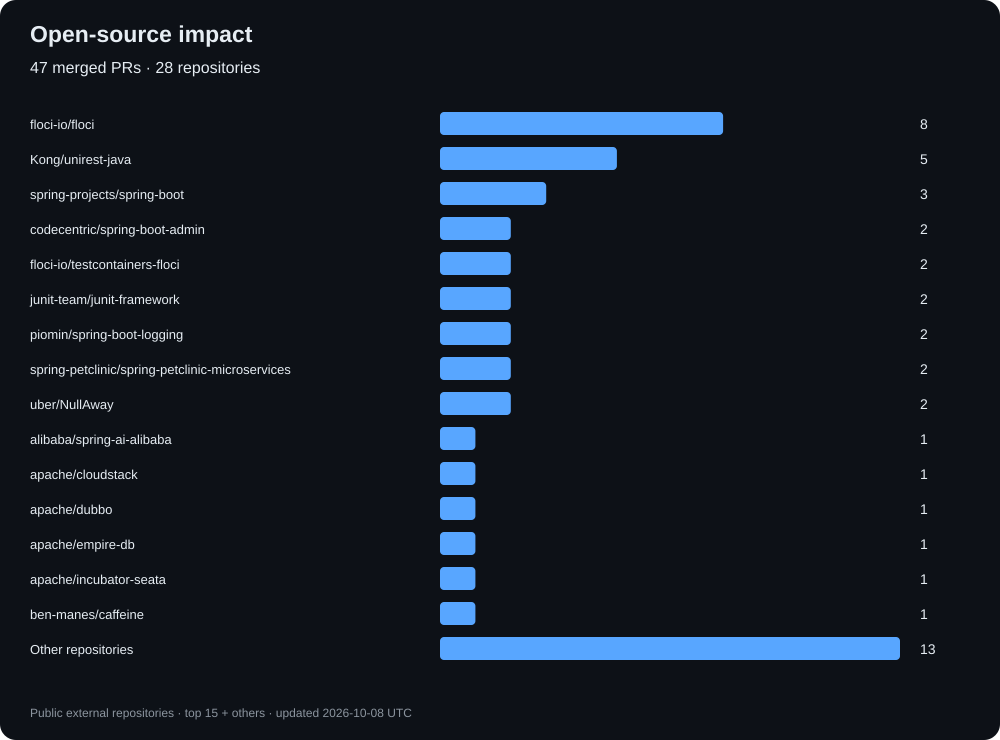

# Hi, I'm Vinod 👋

### Java · Distributed Systems · AI Platform Engineering

I build backend platforms that turn high-volume events into reliable, actionable intelligence.

Currently a **Senior Software Engineer at Airties**, working on device intelligence, network telemetry, behavioral analytics, and cybersecurity. My earlier work spans **open banking, payments, and travel technology**.

[Website](https://www.codingkiddo.com) · [LinkedIn](https://www.linkedin.com/in/vinod-kumar-87962818/) · [LeetCode](https://leetcode.com/u/codingkiddo/)

## Engineering focus

- **Backend & distributed systems:** Java, Spring Boot, event-driven services, Kafka, API design, concurrency, and data consistency.
- **Network & device intelligence:** telemetry pipelines, Wi-Fi quality analysis, anomaly detection, and risk scoring.
- **AI applications:** Spring AI, local models, RAG, tool orchestration, and guardrails.
- **Production reliability:** performance tuning, OpenTelemetry, observability, and targeted regression tests.

## Open-source impact

I contribute bug fixes, regression tests, clearer diagnostics, and reliability improvements to frameworks and developer tools.

*Public merged pull requests authored by codingkiddo, excluding my own repositories. Refreshed weekly. Counts measure contribution activity, not contribution size or complexity.*

## Selected projects

| Project | What it explores |
| --- | --- |
| [Ride-hailing platform](https://github.com/codingkiddo/taxi-mono-repo) | Event-driven service architecture with Java/Spring, PostgreSQL/PostGIS, Kafka, and containerized deployment. |
| [Banking demo](https://github.com/codingkiddo/banking-demo) | Banking application examples in Java. |
| [Spring Boot custom starter](https://github.com/codingkiddo/spring-boot-custom-starter) | Reusable Spring Boot integration and starter development. |

## Tools I work with

**Languages:** Java · Python · TypeScript  
**Backend:** Spring Boot · Spring Security · Spring Data · FastAPI  
**Data & messaging:** Kafka · PostgreSQL · TimescaleDB · Redis · Cassandra · Neo4j  
**Cloud & operations:** AWS · Docker · Kubernetes · OpenTelemetry · Micrometer · Grafana  
**AI:** Spring AI · Ollama · RAG · embeddings · anomaly detection

## Learning in public

I share practical notes on Java internals, system design, concurrency, AI engineering, and production debugging. I enjoy tracing a problem from its symptoms to a reproducible test and a focused fix.

**Oracle Certified Professional, Java SE 6 Programmer**
